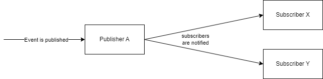
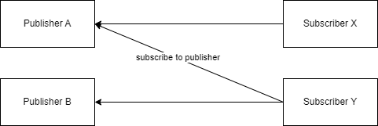

# Base Functionalities
## Introduction

The [publish-subscribe pattern](https://en.wikipedia.org/wiki/Publish%E2%80%93subscribe_pattern) is a pattern frequently used in the world of integration solutions. 
The Functionalities below are implemented in the code in this repository.

## Publisher
In this scenario a publisher can receive an event and "notifies" the subscribers as depicted in the diagram below.

The output of the each subscriber should be returned as a list in the response of the API.

### Data Structure
A publisher needs to be able to store the following data:
- Name
- Number of published events
- List of subscriber

### Functionalities
#### Create new Publisher
Create a new publisher with a name. The name must be unique in the publisher list.

#### Delete Publisher
Delete a publisher from the publisher list, but only if the publisher does not have any subscribers left.

#### Get Publisher
Get publisher by name with the data mentioned in the `Data Structure` section.

#### Add Subscriber to Publisher
Add a subscriber to a publisher, both entities are identified by name.

#### Remove Subscriber from Publisher
Remove a subscriber from a publisher, both entities are identified by name.

#### Send Publishing Event
Send an event to a specific publisher and receive the values of all subscribers to this publisher. Addtionally increment the number of published events on the publisher by 1.

## Subscriber
In this scenario a subscriber can subscribe to multiple publishers as depicted in the diagram below.

### Data Structure
A publisher needs to be able to store the following data:
- Name
- Value to output when an event is triggered

### Functionalities
#### Create new Subscriber
Create a new subscriber with a name and a value that serves as output when the subscriber is notified. The name must be unique in the subscriber list.

#### Delete Subscriber
Delete a subscriber from the subscriber list.

#### Get Subscriber
Get subscriber by name with the data mentioned in the `Data Structure` section.